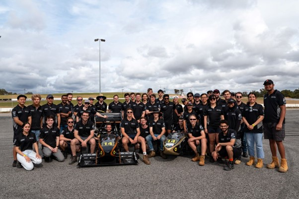
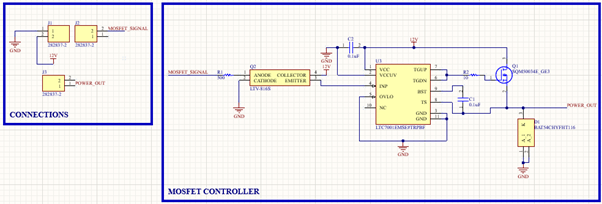
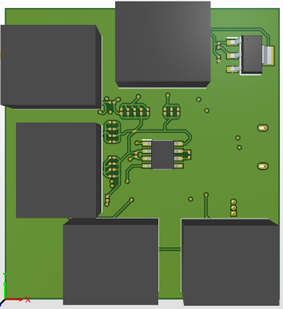
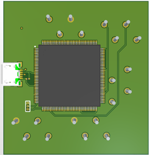
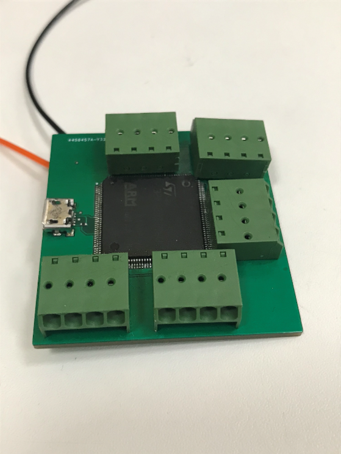
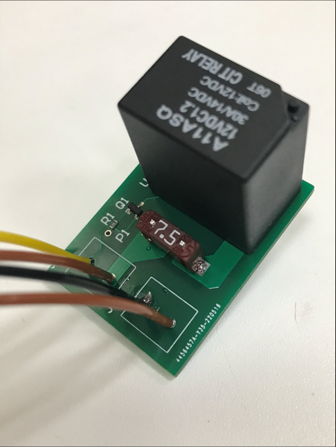
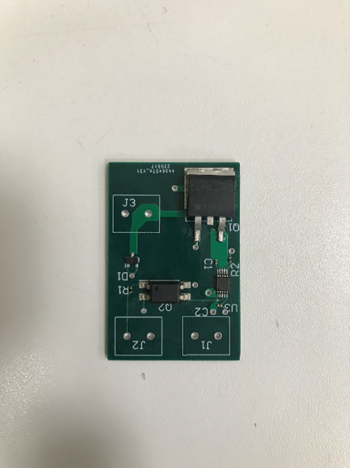

<div align="center">

# Curtin Motorsport Team

Curtin Motorsport Team (CMT) is a non-profit Australasian Formula SAE team that designs, manufactures, and validates an open-wheel race car each year. The team is set to compete with its first competition-ready electric vehicle, CMT22, at the end of this year at Winton Motor Raceway in Victoria.



_Photo of CMT members, CMT21 (2021 competitor), and CMTEVP (electric vehicle prototype)_

# PDM

The Power Distribution Module (PDM) is used to program the car&#39;s cooling system. The radiator fans, accumulator fans, and cooling pumps for the motor and inverter are all dependent on PDM. The PDM must operate reliably, safely, and be Formula SAE rules-compliant.

The PDM consists of three Printed Circuit Boards (PCBs): the Micro (microcontroller) board, the MOSFET board, and the Relay board. The microcontroller board is the main component that controls the PDM. The STM32F429ZIT6 microcontroller is powered by a linear regulator and translates the signals sent from the CAN (Controller Area Network) lines. Based on the CAN information, the microcontroller will then send appropriate instructions to the accumulator fans and/or the MOSFET and Relay boards.

The MOSFET board receives a pulse width modulation (PWM) signal from the microcontroller, at a designated frequency. The signal goes into the driver which drives the MOSFET to supply the stepped-up PWM signal to the radiator fan. By implementing PWM control, the speed of the radiator fans can be adjusted, which maximises energy efficiency of the cooling system. The relay board receives a signal from the microcontroller which allows power to be supplied to the cooling pumps.

**STEP 1**

Making schematics



_MOSFET Board Schematics_

Designing the PDM begins with an understanding of the power requirements, and input and output signal requirements. The team uses Altium Designer to develop schematics of its PCBs. The schematics are a 2D representation of the connections and layouts of an electrical circuit, and are used to plan out connections between various components.

**STEP 2**

PCB Layout

 

_STM32F429ZIT6 PCB Model_

After the schematic is complete and all footprints have been assigned, the components are physically arranged to have an optimal PCB layout. Traces are then drawn to create the connections between the components on the PCB. Power calculations are used to determine the width of the tracks and the size of the polygons on the board.

**STEP 3 **

Gerber Files

The project is then compiled into a Gerber format which is the standard vector format for PCB design. It describes the positions and layouts of everything on our PCB, in order for JLCPCB to manufacture the PCB exactly as designed.

**STEP 4**

Place PCB Order

The PCB is then ordered through the JLCPCB website by attaching the Gerber files. It is checked through the Gerber viewer before finalising the order. Customisation options include choosing dimensions, layers, and colours and the final PCB from JLCPCB can be ordered at a reasonable price. The order was then placed and took approximately two to three weeks to be delivered. The packaging and quality of the ordered PCBs were of a very high standard.

**STEP 5**

Manufacture

Manufacture of the boards consists of soldering and testing the boards to ensure that everything is working as intended.

Manufacture of the micro board involved first soldering the microcontroller, utilising the stencil cutouts to evenly spread the solder paste on all the pads. After that is completed, the linear regulator is soldered then tested to ensure that the power supply works before continuing. Next, all small surface-mount devices (SMD) are soldered on, followed by all through-hole (TH) components.

A similar principle applies for the MOSFET and Relay boards; the SMDs are soldered first before soldering TH components. It is always best to solder the largest components last, as this allows for easier maneuverability of the soldering equipment.

**STEP 6**

Testing



_STM32F429ZIT6 Board_



_RELAY Board_



_MOSFET Board_

The final stage of building a PCB is testing. Testing allows for the validation of PCB design and assesses whether or not a redesign is required. For the MOSFET board, a successful test is defined by the following:

1. 12V supply is connected to Power In, while an oscilloscope is connected to Power Out. The board is connected to a load in the form of a fan.
2. A signal generator, generating a PWM signal, is connected to the signal input, with a 5V amplitude at a set frequency and duty cycle.
3. When the signal generator is switched on, the fan should also turn on.

  1. The frequency reading on the oscilloscope should be the same as the input frequency.
  2. The voltage reading should be the percentage of the duty cycle out of 24V.
  3. Changing the duty cycle of the signal input should change the speed of the fan accordingly.
1. When the signal generator is turned off, the fan should stop as well.

JLCPCB is a trustworthy supplier of PCBs; their PCBs are consistently at a competitive price, are of a reliable quality and have a reasonable delivery time frame. They have great customer support and are always happy to help, including sending email updates to clarify PCB designs before they are manufactured.

Check them out at [https://jlcpcb.com/HAR](https://jlcpcb.com/HAR).``````
</div>
